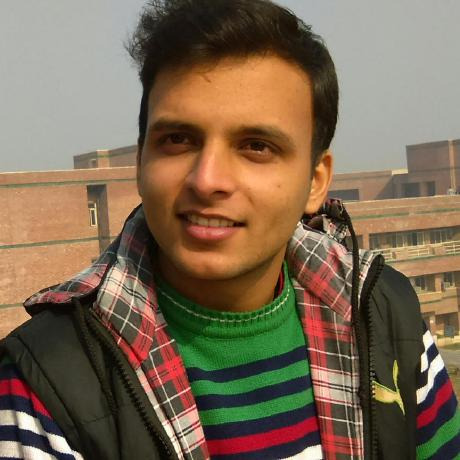

<link href="/pace/themes/blue/pace-theme-barber-shop.css" rel="stylesheet" />

Welcome to my webpage. I am Abhishek Tyagi, a Hardware Engineer working with Samsung Research & Development Institute, Bangalore India. Presently we are working towards developing the next generation of face recognition chips to be employed in Samsung's handheld devices.

My research interest lies in Acceleration of the Neural Networks, with primary focus towards HW/SW Co-Design approach. In my pursuit of getting acquainted with various approaches taken towards hardware accelerators for ML workloads, I have reviewed a few articles and have been keeping their short-summaries (reviews) [here](). 

# Education Background
- B.Tech in Electrical Engineering, Delhi Technological University (formerly Delhi College of Engineering)
  - Graduated with 74.37 % [Ist Class, missed Hons. by 0.6% :( ] with a rank of 19/148 students
  - Awarded with **Prime Minister's Fellowship** for all 4 years for excellent performance throughout my Undergraduate

# Research Experience
I have been lucky enough to be part of some great groups over the years:

- **[Samsung Research & Development Institute - Bangalore](https://research.samsung.com/sri-b)**, India (July 2019 - Present)
- **[Computer Aided Deisgn Laboratory](http://cadl.iisc.ernet.in/cadlab/)**, _Indian Institute of Science(IISc)_, Bengaluru, India (July 2017- June 2019)
- **[Team CAMUS](http://team.inria.fr/camus/)**, _INRIA_, Strasbourg, France (June 2016 - Aug 2016)
- **[Advanced Multicore Systems Laboratory](https://www.iiitd.edu.in/noc/)**, _Indraprastha Institute of Information Technology(IIIT)_, Delhi, India (October 2015 - January 2016)
- **[Texas Instruments - Center for Electronic Design and Technology](http://cedtnsit.in/)**, Delhi, India (December 2014 - January 2015)
- **VLSI Systems Design Lab**, _Delhi Technological Unviersity_, Delhi, India (June 2014- June 2016)

# Research Interests

(For a graphical representation of my experiences across system stack and my potential research direction click **[here](/research_int/image)**

- Computer Architecture
- Hardware Accelerators Design for ML, Graph Processing etc
- Machine Learning
- Quantum Computing

# Personal Interests
- Sports is the 'Thing' to me. A huge Manchester United Fan (#GGMU)
- Cricket is in the blood. Though, stopped following it much once Sachin Retired.
- Cars interests me. Training for my [FMSCI](http://licence.fmsci.co.in/) license.
